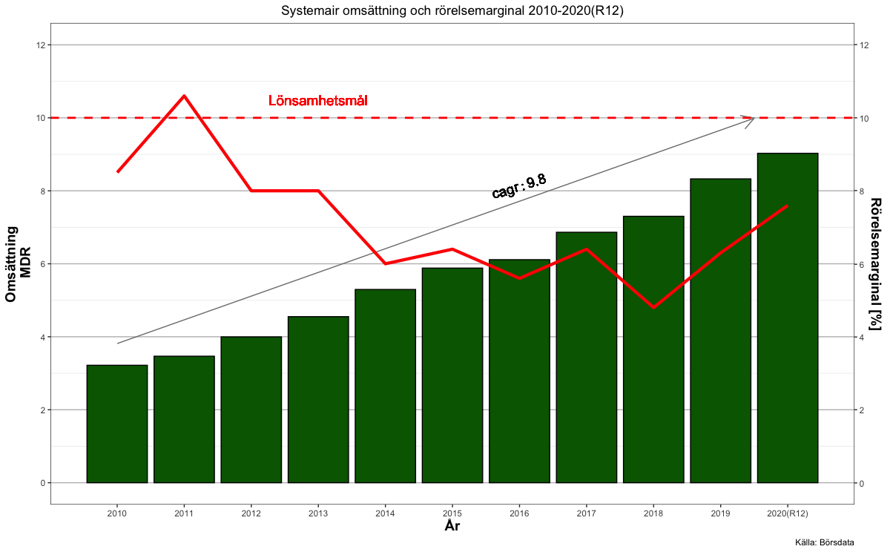

Nyckelfaktorer
==============

Förvärvsdriven bransch
----------------------

Kamp mellan halvstora spelare om mindre aktörer på den fragmenterade
marknaden.

Historiskt fint bolag
---------------------

Omsättningstillväxten har mellan 2005 och 2019 varit 11,325 procent.

Pilotskolan
-----------

Gerald Engström som är styrelseordförande i Systemair grundade företaget
och äger idag 42,6 procent av alla aktier i företaget.

Bakgrund
========

Systemair är Skinnskattbergs motor. Se kartan för att få en uppfattning
om var Skinnskatteberg befinner sig i Sverige.

Hämtar data
-----------

    library(borsdata)
    year<-fetch_year(221,key = key)
    r12<-fetch_r12(221,key = key)
    kvartal<-fetch_quarter(221,key = key)

Figur över utvecklingen 2010-2020e
==================================

Att jämföra med till exempelvis Lindab

